# Lecture Two

> "Haskell is useless"
> — Simon Peyton Jones

So, let's learn how to write smart contracts in Haskell! [Watch this video](https://youtu.be/iSmkqocn0oQ), it makes sense.

###### TODOS.

* Add references and footnotes.

### 1. Introduction

Within this set of lecture notes, some information about UTxO (or extended UTxOs if you prefer) is initially discussed (the constraints required for consumption). The notion of on-chain and off-chain scripts is discussed. A reminder of what a EUTxO model is, is presented in detail (including information about datum, redeemers and context). We discuss some of the exercises demonstrated within the second lecture of the second cohort of the Plutus Pioneer Program. This mainly includes how to implement validation on-chain (validators, mkValidator in Haskell, which compiles down to plutus-core). We do this through the use of a redeemer (initially very naively using a gift smart contract, which essentially means the redeemer always evaluates to True, then we switch to having the redeemer always evaluate to False - essentially never allowing the consumption of a (E)UTxO - burning... We then defined a redeemer as a form of Data, initially a tuple (bool, bool), if the tuple bool values are equal, then the UTxO can be consumed... Then a Haskell type report (I believe it's called - similar to an object, expect for each property Haskell creates a function, if I understand correctly). This performed the same function as the tuple (the same constraints)... We also learn how to create script addresses.

#### 1.1 Catch Up | EUTxO - Additional Information

Previously a pioneer brought up the notion of "what if we didn't add any kind of 'end-point' to our smart contract? Would the funds just get stuck within the contract?". Unfortunately, that would appear to be the case (if the script was coded in such a manner that there was no stopping criteria implemented". This is to say that: in order to change the state of the blockchain (to consume any given UTxO) a transaction must be executed on-chain (and validated), such that the previous UTxO is consumed and the next UTxO is created. UTxOs will never spring into action themselves.

* New transactions are generated (initiated) by a wallet (which is essentially a collection of keys, as your wallet has the private key to some UTxOs outputs 'public' key (which are thought of as scripts and redeemers).
* The state of any given UTxO can only be changed if the outputs are verified by satisfying the arbitrary logic held at the script address, using the required redeemer (input parameters).
* You NEED to have some kind of 'close clause' - that could even just be 'expire after X blocks'.
* However, off-chain (wallet) logic can do some sophisticated stuff (but we'll get to that later).
* On-chain Logic is about Validation (can a UTxO be consumed?)
* Off-chain logic is about initiating transactions that effect the state of any given UTxO for which you hold the required redeemer (think of it somewhat like a key to sign a digital signature, except, it's not..)

### 2. The Difference: (E)UTxO VS UTxO

A simple UTxO model usually takes a hash of some form of public key and uses this as the address. The redeemer for the UTxO model can then simply derive the public key and then sign the transaction using the paired private key (ensuring they are in fact the person who holds the private key in their wallet; and so a UTxO is consumed by signing the UTxO and a new UTxO is created with inputs and outputs.

(Extended)UTxOs have a number of address types, one of which is a script addresses. At this address a smart contract can exist on-chain that can run arbitrary logic.

Transactions that want to consume an (E)UTxO sitting at a script address are validated by a node, the node will run the script and depending on the result of the script (typically TRUE / FALSE, but other more complicated outputs can exist I believe) consumption is permitted or non-permitted.

### 2.1 Redeemers

A redeemer is an arbitrary piece of data that is fed to the script (similar to a set of parameters), a the script requires this data to satisfy the constraints and reach a deterministic outcome (if the script has been written properly).

### 2.2 Datum

Datum is a 'string', a piece of data that sits at the output of any given (E)UTxO. It's great for providing an area to store the output state of a UTxO script or possibly even a 'linked-list' of (E)UTxOs.

### 2.3 Context

This is essentially the scope of the script. Do we allow the script to see almost nothing, or do we allow it to see the entire blockchain? In the case of Cardano, it can see the the scope of the current UTxO, it's inputs and it's outputs.

### 2.4 Plutus Script

Three pieces of data required to create a valid Plutus script:

1. Redeemer
2. Datum
3. Context

### 3. Data Types In Plutus (as implemented in Haskell)

Haskell data type: Data (at least at the low level implementation of Plutus (plutus-core), in real life nobody uses Data as the data type in a script, as there are better alternatives. But it is better to learn from first principals.

##### Haskell Data Type: Data

	{-# LANGUAGE BangPatterns       #-}
	{-# LANGUAGE DeriveAnyClass     #-}
	{-# LANGUAGE DerivingStrategies #-}
	{-# LANGUAGE LambdaCase         #-}
	{-# LANGUAGE MultiWayIf         #-}
	{-# LANGUAGE OverloadedStrings  #-}
	{-# LANGUAGE ViewPatterns       #-}
	
	-- | Notes - JD
	-- This is a low level 'data type' within PlutusCore (somewhat confusing since plutus-core
	-- is actually System F Omega + Recerive Data Types, whilst PlutusCore is the high level
	-- implementation in Haskell which uses plutus-tx to compile to System F. So, PlutusCore is
	-- actually just Plutus?
	
	module PlutusCore.Data (Data (..)) where
	
	import           Codec.CBOR.Decoding       (Decoder)
	import qualified Codec.CBOR.Decoding       as CBOR
	import qualified Codec.CBOR.Term           as CBOR
	import           Codec.Serialise           (Serialise (decode, encode))
	import           Codec.Serialise.Decoding  (decodeSequenceLenIndef, decodeSequenceLenN)
	import           Control.DeepSeq           (NFData)
	import           Control.Monad.Except
	import           Data.Bifunctor            (bimap)
	import qualified Data.ByteString           as BS
	import           Data.Text.Prettyprint.Doc
	import           GHC.Generics
	import           Prelude
	
	-- | A generic "data" type.
	--
	-- The main constructor 'Constr' represents a datatype value in sum-of-products
	-- form: @Constr i args@ represents a use of the @i@th constructor along with its arguments.
	--
	-- The other constructors are various primitives.
	
	-- | J.D Notes: Map [(Data, Data)] are key-value pairs which represent tuples of (data, data)
	-- If I understand correctly, a list of key-value pairs = map
	-- Each of these | are constructors.
	
	
	data Data =
	      Constr Integer [Data]
	    | Map [(Data, Data)]
	    | List [Data]
	    | I Integer
	    | B BS.ByteString
	    deriving stock (Show, Eq, Ord, Generic)
	    deriving anyclass (NFData)
	
	instance Pretty Data where
	    pretty = \case
	        Constr _ ds -> angles (sep (punctuate comma (fmap pretty ds)))
	        Map entries -> braces (sep (punctuate comma (fmap (\(k, v) -> pretty k <> ":" <+> pretty v) entries)))
	        List ds     -> brackets (sep (punctuate comma (fmap pretty ds)))
	        I i         -> pretty i
	        B b         -> viaShow b
	
	{- Note [Encoding via Term]
	We want to write a custom encoder/decoder for Data (i.e. not use the Generic version), but actually
	doing this is a pain. So instead we go via the CBOR 'Term' representation, which lets us process a
	more structured representation, which is a lot easier.
	-}
	
	instance Serialise Data where
	    -- See Note [Encoding via Term]
	    encode = CBOR.encodeTerm . toTerm
	    decode = decodeData
	
	{- Note [CBOR alternative tags]
	We've proposed to add additional tags to the CBOR standard to cover (essentially) sum types.
	This is exactly what we need to encode the 'Constr' constructor of 'Data' in an unambiguous way.
	The tags aren't *quite* accepted yet, but they're clearly going to accept so we might as well
	start using them.
	The scheme is:
	- Alternatives 0-6 -> tags 121-127
	- Alternatives 7-127 -> tags 1280-1400
	- Any alternatives, including those that don't fit in the above -> tag 102 followed by an integer for the actual alternative.
	-}
	
	-- | Turn Data into a CBOR Term.
	toTerm :: Data -> CBOR.Term
	toTerm = \case
	    -- See Note [CBOR alternative tags]
	    Constr i ds | 0 <= i && i < 7   -> CBOR.TTagged (fromIntegral (121 + i)) (CBOR.TList $ fmap toTerm ds)
	    Constr i ds | 7 <= i && i < 128 -> CBOR.TTagged (fromIntegral (1280 + (i - 7))) (CBOR.TList $ fmap toTerm ds)
	    Constr i ds | otherwise         -> CBOR.TTagged 102 (CBOR.TList $ CBOR.TInteger i : fmap toTerm ds)
	    Map es                          -> CBOR.TMap (fmap (bimap toTerm toTerm) es)
	    List ds                         -> CBOR.TList $ fmap toTerm ds
	    I i                             -> CBOR.TInteger i
	    B b                             -> CBOR.TBytes b
	
	{- Note [Definite and indefinite forms of CBOR]
	CBOR is annoying and you can have both definite (with a fixed length) and indefinite lists, maps, etc.
	So we have to be careful to handle both cases when decoding. When encoding we simply don't make
	the indefinite kinds.
	-}
	
	-- | Turn a CBOR Term into Data if possible.
	decodeData :: forall s. Decoder s Data
	decodeData = CBOR.peekTokenType >>= \case
	  CBOR.TypeUInt         -> I <$> CBOR.decodeInteger
	  CBOR.TypeUInt64       -> I <$> CBOR.decodeInteger
	  CBOR.TypeNInt         -> I <$> CBOR.decodeInteger
	  CBOR.TypeNInt64       -> I <$> CBOR.decodeInteger
	  CBOR.TypeInteger      -> decodeBoundedInteger
	
	  CBOR.TypeBytes        -> decodeBoundedBytes
	  CBOR.TypeBytesIndef   -> decodeBoundedBytes
	
	  CBOR.TypeListLen      -> decodeList
	  CBOR.TypeListLen64    -> decodeList
	  CBOR.TypeListLenIndef -> decodeList
	
	  CBOR.TypeMapLen       -> decodeMap
	  CBOR.TypeMapLen64     -> decodeMap
	  CBOR.TypeMapLenIndef  -> decodeMap
	
	  CBOR.TypeTag          -> decodeConstr
	  CBOR.TypeTag64        -> decodeConstr
	
	  t                     -> fail ("Unrecognized value of type " ++ show t)
	
	decodeBoundedInteger :: Decoder s Data
	decodeBoundedInteger = do
	  i <- CBOR.decodeInteger
	  unless (inBounds i) $ fail "Integer exceeds 64 bytes"
	  pure $ I i
	  where
	  bound :: Integer
	  -- The maximum value of a 64 byte unsigned integer
	  bound = 2 ^ (64 * 8 :: Integer) - 1
	  inBounds x = (x <= bound) && (x >= -1 - bound)
	
	decodeBoundedBytes :: Decoder s Data
	decodeBoundedBytes =  do
	  b <- CBOR.decodeBytes
	  if BS.length b <= 64
	    then pure $ B b
	    else fail $ "ByteString exceeds 64 bytes"
	
	decodeList :: Decoder s Data
	decodeList = List <$> decodeListOf decodeData
	
	decodeListOf :: Decoder s x -> Decoder s [x]
	decodeListOf decoder = CBOR.decodeListLenOrIndef >>= \case
	  Nothing -> decodeSequenceLenIndef (flip (:)) [] reverse   decoder
	  Just n  -> decodeSequenceLenN     (flip (:)) [] reverse n decoder
	
	decodeMap :: Decoder s Data
	decodeMap = CBOR.decodeMapLenOrIndef >>= \case
	  Nothing -> Map <$> decodeSequenceLenIndef (flip (:)) [] reverse   decodePair
	  Just n  -> Map <$> decodeSequenceLenN     (flip (:)) [] reverse n decodePair
	  where
	  decodePair = (,) <$> decodeData <*> decodeData
	
	-- See note [CBOR alternative tags] for the encoding scheme.
	decodeConstr :: Decoder s Data
	decodeConstr = CBOR.decodeTag64 >>= \case
	  102 -> decodeConstrExtended
	  t | 121 <= t && t < 128 ->
	         Constr (fromIntegral t - 121) <$> decodeListOf decodeData
	  t | 1280 <= t && t < 1401 ->
	         Constr ((fromIntegral t - 1280) + 7) <$> decodeListOf decodeData
	  t -> fail ("Unrecognized tag " ++ show t)
	  where
	  decodeConstrExtended = do
	    lenOrIndef <- CBOR.decodeListLenOrIndef
	    i <- CBOR.decodeWord64
	    xs <- case lenOrIndef of
	      Nothing -> decodeSequenceLenIndef (flip (:)) [] reverse       decodeData
	      Just n  -> decodeSequenceLenN     (flip (:)) [] reverse (n-1) decodeData
	    pure $ Constr (fromIntegral i) xs

If we would like to see information about the various Data constructors, we can do so by:

1. opening up a terminal window.
2. navigating to plutus-pioneer-program
3. opening the cabal.project file
4. grabbing the current git checkout key for Plutus,
5. then navigating to the Plutus repo
6. git checkout <key>
7. starting a nix-shell,
8. navigating back to week02
9. starting cabal repl & entering the following code:

 

	import PlutusTx
	:i Data
	
	Return Value:
	
	Prelude PlutusTx Week02.Burn> :i Data
	type Data :: *
	data Data
	  = Constr Integer [Data]
	  | Map [(Data, Data)]
	  | List [Data]
	  | I Integer
	  | B bytestring-0.10.12.0:Data.ByteString.Internal.ByteString
	  	-- Defined in ‘plutus-core-0.1.0.0:PlutusCore.Data’
	instance Eq Data
	  -- Defined in ‘plutus-core-0.1.0.0:PlutusCore.Data’
	instance Ord Data
	  -- Defined in ‘plutus-core-0.1.0.0:PlutusCore.Data’
	instance Show Data
	  -- Defined in ‘plutus-core-0.1.0.0:PlutusCore.Data’
	instance IsData Data -- Defined in ‘PlutusTx.IsData.Class’

Setting a Data value (simple Integer):

	import PlutusTx
	I 42
	-- | What type is our new piece of data I, which is = to 42?
	:t I 42
	-- | Return Value:
	I 42 :: Data
	-- | As we can see it is of type Data
	
Setting a data value (of type Bytestring):

	-- | Normal strings in Haskell are just sequences of characters
	-- to use bytestrings, we need to import a module call XOverloadedStrings
	import PlutusTx
	set -XOverloadedStrings
	B "Hell"
	:t B "Hello"
	>> B "Hello" :: Data
	
*You Get The Idea...*

*Very similar to JSON apparently...*

--

### 4. Week02 Exercises

**Writing Gift.hs**

You'll want to start writing your Haskell program with the following template:

	{-# LANGUAGE DataKinds           #-}
	{-# LANGUAGE FlexibleContexts    #-}
	{-# LANGUAGE NoImplicitPrelude   #-}
	{-# LANGUAGE ScopedTypeVariables #-}
	{-# LANGUAGE TemplateHaskell     #-}
	{-# LANGUAGE TypeApplications    #-}
	{-# LANGUAGE TypeFamilies        #-}
	{-# LANGUAGE TypeOperators       #-}
	
	module Week02.Gift where
	
	import           Control.Monad       hiding (fmap)
	import           Data.Map            as Map
	import           Data.Text           (Text)
	import           Data.Void           (Void)
	import           Plutus.Contract
	import           PlutusTx            (Data (..))
	import qualified PlutusTx
	import           PlutusTx.Prelude    hiding (Semigroup(..), unless)
	import           Ledger              hiding (singleton)
	import           Ledger.Constraints  as Constraints
	import qualified Ledger.Scripts      as Scripts
	import           Ledger.Ada          as Ada
	import           Playground.Contract (printJson, printSchemas, ensureKnownCurrencies, stage)
	import           Playground.TH       (mkKnownCurrencies, mkSchemaDefinitions)
	import           Playground.Types    (KnownCurrency (..))
	import           Prelude             (IO, Semigroup (..), String)
	import           Text.Printf         (printf)
	
	{-# OPTIONS_GHC -fno-warn-unused-imports #-}
	
	{-# INLINABLE mkValidator #-}
	
Now, you'll be able to easily import, compile and run it in the repl by simply typing (from the week02 directory):

	:l /src/Week02/Gift.hs
	import Leger.Scripts
	import PlutusTx
	
	-- | This is where we call functions from our script
	
For example, to create a basic validator:

	mkValidator :: Data -> Data -> Data -> ()
	mkValidator _ _ _ = ()
	
	validator :: Validator
	validator = mkValidatorScript $$(PlutusTx.compile [|| mkValidator ||])
	
Then switch to the repl:

	:t mkValidatorScript
	
##### Explaination

Right, so I'm no Haskell superman, so I'll do my best to explain here...

* When creating (constructing) a validator, you need to specify the three parameters as mentioned above (the redeemer, the datum and the context).
* mkValidator is a fairly self-explanatory function (make validator), we're saying that the three arguments being passed to the constructor (::) are of type data, data and data. Furthermore the return type is of type 'unit'.
* When we assign the parameters to mkValidator, we leave them blank. In this simple example we do not care about the redeemer (as we're creating a gift script that anybody can 'grab' the ADA from the address we eventually generate), the datum or the context (as it is a very simple smart contract).
* Now that our 'mkValidator' function is defined, we can use it to construct a validator (of type Validator: validator :: Validator).
* We produce the validator by compiling mkValidator to Plutus using PlutusTx (the Plutus Compiler).
* This uses a Haskell template to achieve this (essentially a program that writes another program).

<pre><code>validator = mkValidatorScript $$(PlutusTx.compile [|| mkValidator ||])</code></pre>
	
Now that we have our validator defined as a function which will compile our mkValidator function (which I suppose you can think of as an object), via a Haskell template using PlutusTx, we can run it within the repl:

	:t mkValidatorScript
	
This will assign the output from the compiler to the validator (if I understand correctly).

Now when we check what type 'validator' is in the repl, we see it is of type script. So it would appear it has compiled. But to give you peace of mind, you can check by running:

	unScript \$ getValidator validator

And you should see an output such as:

	Program () (Version () 1 0 0) (Apply () (Apply () (LamAbs () (DeBruijn {dbnIndex = 0}) (LamAbs () (DeBruijn {dbnIndex = 0}) (Apply () (Apply () (Apply () (LamAbs () (DeBruijn {dbnIndex = 0}) (LamAbs () (DeBruijn {dbnIndex = 0}) (LamAbs () (DeBruijn {dbnIndex = 0}) (Apply () (Apply () (Apply () (Apply () (Apply () (Apply () (LamAbs () (DeBruijn {dbnIndex = 0}) (LamAbs () (DeBruijn {dbnIndex = 0}) (LamAbs () (DeBruijn {dbnIndex = 0}) (LamAbs () (DeBruijn {dbnIndex = 0}) (LamAbs () (DeBruijn {dbnIndex = 0}) (LamAbs () (DeBruijn {dbnIndex = 0}) (Apply () (Apply () (LamAbs () (DeBruijn {dbnIndex = 0}) (LamAbs () (DeBruijn {dbnIndex = 0}) (Apply () (LamAbs () (DeBruijn {dbnIndex = 0}) (Var () (DeBruijn {dbnIndex = 1}))) (LamAbs () (DeBruijn {dbnIndex = 0}) (LamAbs () (DeBruijn {dbnIndex = 0}) (LamAbs () (DeBruijn {dbnIndex = 0}) (Var () (DeBruijn {dbnIndex = 5})))))))) (Delay () (LamAbs () (DeBruijn {dbnIndex = 0}) (Var () (DeBruijn {dbnIndex = 1}))))) (LamAbs () (DeBruijn {dbnIndex = 0}) (Var () (DeBruijn {dbnIndex = 1})))))))))) (LamAbs () (DeBruijn {dbnIndex = 0}) (Delay () (LamAbs () (DeBruijn {dbnIndex = 0}) (LamAbs () (DeBruijn {dbnIndex = 0}) (LamAbs () (DeBruijn {dbnIndex = 0}) (LamAbs () (DeBruijn {dbnIndex = 0}) (LamAbs () (DeBruijn {dbnIndex = 0}) (Apply () (Var () (DeBruijn {dbnIndex = 5})) (Var () (DeBruijn {dbnIndex = 6}))))))))))) (LamAbs () (DeBruijn {dbnIndex = 0}) (LamAbs () (DeBruijn {dbnIndex = 0}) (Delay () (LamAbs () (DeBruijn {dbnIndex = 0}) (LamAbs () (DeBruijn {dbnIndex = 0}) (LamAbs () (DeBruijn {dbnIndex = 0}) (LamAbs () (DeBruijn {dbnIndex = 0}) (LamAbs () (DeBruijn {dbnIndex = 0}) (Apply () (Apply () (Var () (DeBruijn {dbnIndex = 4})) (Var () (DeBruijn {dbnIndex = 7}))) (Var () (DeBruijn {dbnIndex = 6})))))))))))) (LamAbs () (DeBruijn {dbnIndex = 0}) (Delay () (LamAbs () (DeBruijn {dbnIndex = 0}) (LamAbs () (DeBruijn {dbnIndex = 0}) (LamAbs () (DeBruijn {dbnIndex = 0}) (LamAbs () (DeBruijn {dbnIndex = 0}) (LamAbs () (DeBruijn {dbnIndex = 0}) (Apply () (Var () (DeBruijn {dbnIndex = 3})) (Var () (DeBruijn {dbnIndex = 6}))))))))))) (LamAbs () (DeBruijn {dbnIndex = 0}) (Delay () (LamAbs () (DeBruijn {dbnIndex = 0}) (LamAbs () (DeBruijn {dbnIndex = 0}) (LamAbs () (DeBruijn {dbnIndex = 0}) (LamAbs () (DeBruijn {dbnIndex = 0}) (LamAbs () (DeBruijn {dbnIndex = 0}) (Apply () (Var () (DeBruijn {dbnIndex = 2})) (Var () (DeBruijn {dbnIndex = 6}))))))))))) (LamAbs () (DeBruijn {dbnIndex = 0}) (Delay () (LamAbs () (DeBruijn {dbnIndex = 0}) (LamAbs () (DeBruijn {dbnIndex = 0}) (LamAbs () (DeBruijn {dbnIndex = 0}) (LamAbs () (DeBruijn {dbnIndex = 0}) (LamAbs () (DeBruijn {dbnIndex = 0}) (Apply () (Var () (DeBruijn {dbnIndex = 1})) (Var () (DeBruijn {dbnIndex = 6}))))))))))) (LamAbs () (DeBruijn {dbnIndex = 0}) (Var () (DeBruijn {dbnIndex = 1}))))))) (Delay () (Delay () (LamAbs () (DeBruijn {dbnIndex = 0}) (LamAbs () (DeBruijn {dbnIndex = 0}) (Var () (DeBruijn {dbnIndex = 2}))))))) (Delay () (LamAbs () (DeBruijn {dbnIndex = 0}) (LamAbs () (DeBruijn {dbnIndex = 0}) (Delay () (LamAbs () (DeBruijn {dbnIndex = 0}) (LamAbs () (DeBruijn {dbnIndex = 0}) (Apply () (Apply () (Var () (DeBruijn {dbnIndex = 1})) (Var () (DeBruijn {dbnIndex = 4}))) (Var () (DeBruijn {dbnIndex = 3})))))))))) (Delay () (LamAbs () (DeBruijn {dbnIndex = 0}) (Var () (DeBruijn {dbnIndex = 1}))))))) (Delay () (Delay () (LamAbs () (DeBruijn {dbnIndex = 0}) (LamAbs () (DeBruijn {dbnIndex = 0}) (Delay () (LamAbs () (DeBruijn {dbnIndex = 0}) (Apply () (Apply () (Var () (DeBruijn {dbnIndex = 1})) (Var () (DeBruijn {dbnIndex = 3}))) (Var () (DeBruijn {dbnIndex = 2})))))))))) (Delay () (Delay () (LamAbs () (DeBruijn {dbnIndex = 0}) (Var () (DeBruijn {dbnIndex = 1}))))))
	
*I believe this is the plutus-core language: System F Omega with Recursive Data Types (?)*

So we know it's compiled, now we need to generate an address for the script. Which is actually pretty easy and self-explanatory:

	valHash :: Ledger.ValidatorHash
	valHash = Scripts.validatorHash validator
	
	scrAddress :: Ledger.Address
	scrAddress = scriptAddress validator
	
Now when you reload the script in the repl, you'll see you have a hash and an scrAddress.

*Lars then goes on to gloss over the off-chain code..*

### Gift.hs | Whole Programme
	
	{-# LANGUAGE DataKinds           #-}
	{-# LANGUAGE FlexibleContexts    #-}
	{-# LANGUAGE NoImplicitPrelude   #-}
	{-# LANGUAGE ScopedTypeVariables #-}
	{-# LANGUAGE TemplateHaskell     #-}
	{-# LANGUAGE TypeApplications    #-}
	{-# LANGUAGE TypeFamilies        #-}
	{-# LANGUAGE TypeOperators       #-}
	
	module Week02.Gift where
	
	import           Control.Monad       hiding (fmap)
	import           Data.Map            as Map
	import           Data.Text           (Text)
	import           Data.Void           (Void)
	import           Plutus.Contract
	import           PlutusTx            (Data (..))
	import qualified PlutusTx
	import           PlutusTx.Prelude    hiding (Semigroup(..), unless)
	import           Ledger              hiding (singleton)
	import           Ledger.Constraints  as Constraints
	import qualified Ledger.Scripts      as Scripts
	import           Ledger.Ada          as Ada
	import           Playground.Contract (printJson, printSchemas, ensureKnownCurrencies, stage)
	import           Playground.TH       (mkKnownCurrencies, mkSchemaDefinitions)
	import           Playground.Types    (KnownCurrency (..))
	import           Prelude             (IO, Semigroup (..), String)
	import           Text.Printf         (printf)
	
	{-# OPTIONS_GHC -fno-warn-unused-imports #-}
	
	{-# INLINABLE mkValidator #-}
	mkValidator :: Data -> Data -> Data -> ()
	mkValidator _ _ _ = ()
	
	validator :: Validator
	validator = mkValidatorScript $$(PlutusTx.compile [|| mkValidator ||])
	
	valHash :: Ledger.ValidatorHash
	valHash = Scripts.validatorHash validator
	
	scrAddress :: Ledger.Address
	scrAddress = scriptAddress validator
	
	type GiftSchema =
	            Endpoint "give" Integer
	        .\/ Endpoint "grab" ()
	
	give :: AsContractError e => Integer -> Contract w s e ()
	give amount = do
	    let tx = mustPayToOtherScript valHash (Datum $ Constr 0 []) $ Ada.lovelaceValueOf amount
	    ledgerTx <- submitTx tx
	    void $ awaitTxConfirmed $ txId ledgerTx
	    logInfo @String $ printf "made a gift of %d lovelace" amount
	
	grab :: forall w s e. AsContractError e => Contract w s e ()
	grab = do
	    utxos <- utxoAt scrAddress
	    let orefs   = fst <$> Map.toList utxos
	        lookups = Constraints.unspentOutputs utxos      <>
	                  Constraints.otherScript validator
	        tx :: TxConstraints Void Void
	        tx      = mconcat [mustSpendScriptOutput oref $ Redeemer $ I 17 | oref <- orefs]
	    ledgerTx <- submitTxConstraintsWith @Void lookups tx
	    void $ awaitTxConfirmed $ txId ledgerTx
	    logInfo @String $ "collected gifts"
	
	endpoints :: Contract () GiftSchema Text ()
	endpoints = (give' `select` grab') >> endpoints
	  where
	    give' = endpoint @"give" >>= give
	    grab' = endpoint @"grab" >>  grab
	
	mkSchemaDefinitions ''GiftSchema
	
	mkKnownCurrencies []

### Testing In The Playground

Similarly to the first week, we need to start a couple of nix-shells. If you've not done so already, go ahead and checkout to the required branch for Week02:

	cd ~/code/plutus-pioneer-program/code/week02
	less cabal.project
	
Now you're looking for the tag under the 'source-repository-package':

In this case I believe it's: **81ba78edb1d634a13371397d8c8b19829345ce0d**

Go ahead and copy the tag, change directory to ~/code/plutus and checkout to that branch / commit

	git checkout 81ba78edb1d634a13371397d8c8b19829345ce0d
	
Now you can spin up a couple of nix-shells and run the Week02 code:

	cd ~/code/plutus
	nix-shell
	cd plutus-playground-client
	plutus-playground-server
	...
	// open a new shell
	...
	cd ~/code/plutus-pioneer-program
	cabal build
	...
	project builds
	...
	cd ~/code/plutus/plutus-pioneer-client
	npm start
	...
	// if it throws an error, you may have to run something like:
	npm install && plutus-playground-generate-purs && npm run purs:compile && npm run webpack:server
	...
	// at this point the app should be viewable @ localhost:8009
	
 

Now we're going to start testing our Haskell program: Gift.hs

First, copy and paste the code from you editor into the playground, compile and simulate.

Then feel free to play around with the give and grab functions an of course the wait functions:

 

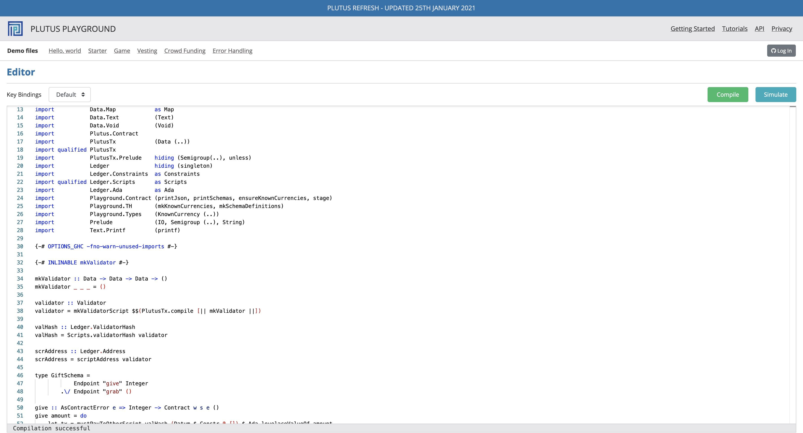

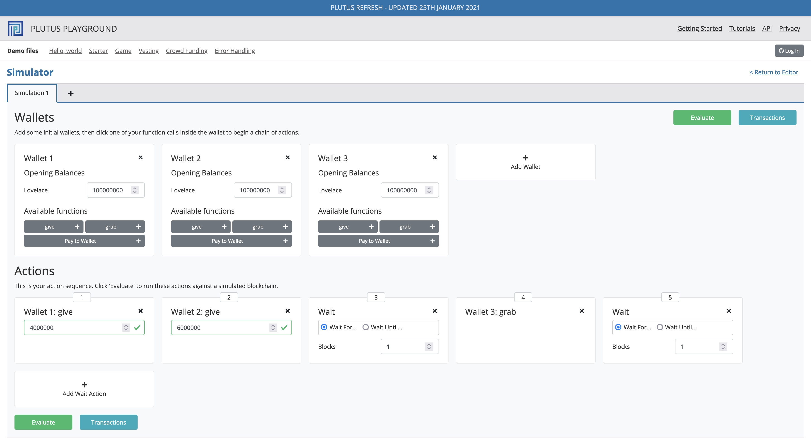

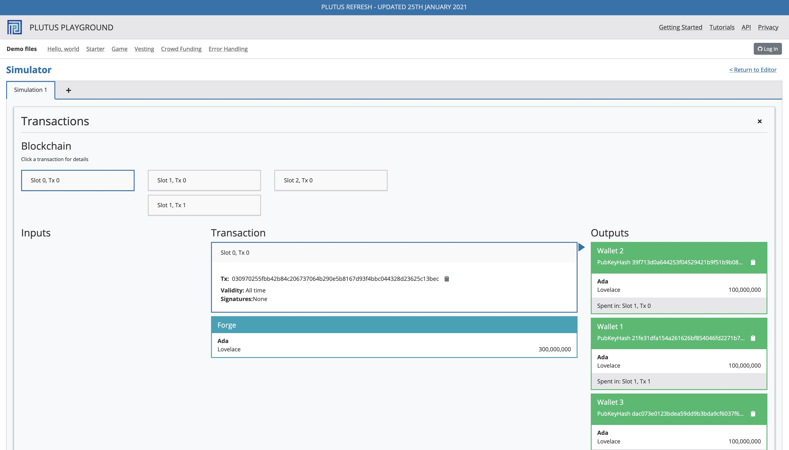

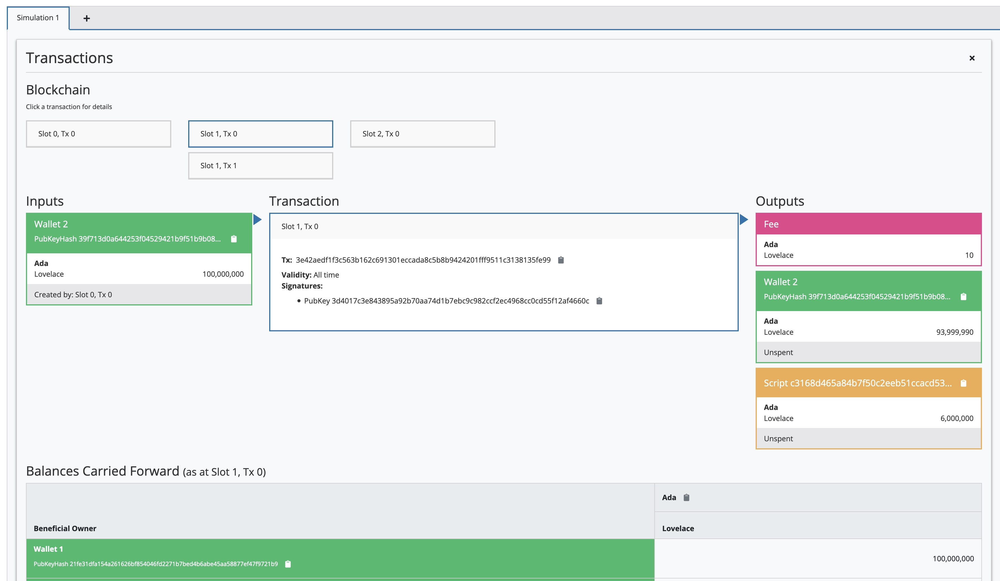

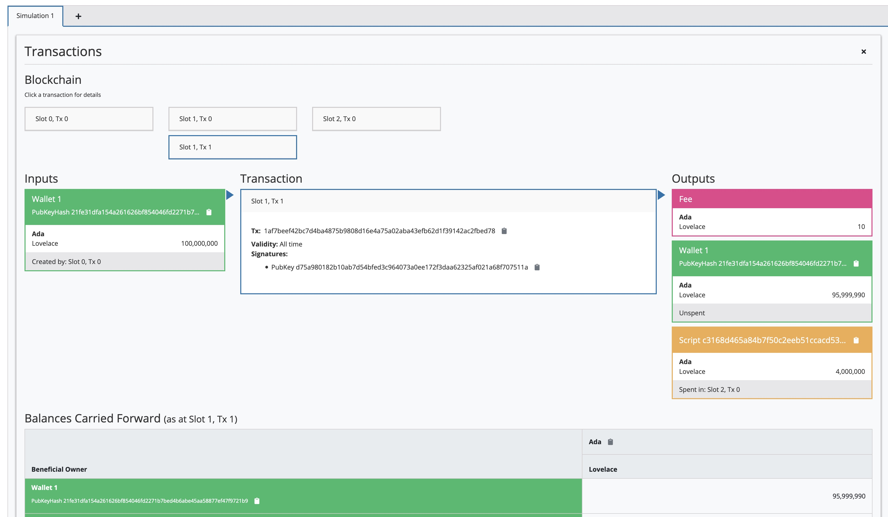

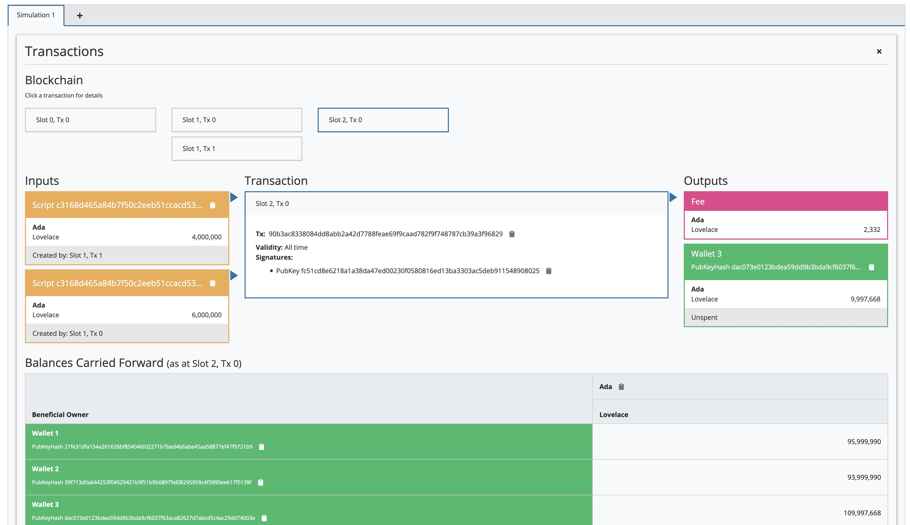

 

# 5. Homework 1 - Implementation One & 2:

During Homework 1, the validator that we're creating will return True if and only if the redeemer is a tuple that consists of two matching boolean values. For example: <pre><code>(True, True)</code></pre> or <pre><code>(False, False)</code></pre>

It turns out (to the Haskell novice) that this can be implemented in at least two ways. The first way is, sloppy...

	-- This should validate if and only if the two Booleans in the redeemer are equal!
	-- JD: mkValidator taes three parameters (dataum, redeemer and the Context) and returns, in this 	-- case a boolean value (as I imagine it often would).
	mkValidator :: () -> (Bool, Bool) -> ScriptContext -> Bool
	-- now we can call mkValidator with a unit datum, a tuple redeemer (bool, bool), and an empty 	-- context (ScriptContext = _ )
	-- each | (pipe) is essentially an 'else if statement'
	-- otherwise is the final else stateent
	-- the equals sign is the return value
	-- Thus, if the redeemer evaluates to (True, True) else if (False, False), the redeemer returns
	-- True
	-- otherwise the redeemer returns false
	-- note that if the redeemer returns True, the UTxO is consumed, otherwise it is not
	mkValidator () (a, b) _
	  | (a, b) == (True, True) = True
	  | (a, b) == (False, False) = True
	  | otherwise = False
	  
However, there is a much nicer way of implementing this, in 'short-form'

	-- we retain the same line of code as previously written at the top
	mkValidator :: () -> (Bool, Bool) -> ScriptContext -> Bool
	-- traceIfFalse is a Plutus function that will return false under the condition
	-- that a !== b, think of it like this:
	-- traceIfFalse: Check The Condition ($) a == b (return the evaluation of a == b)
	-- also, throw an 'exception' of sorts that is described as "Wrong Redeemer"
	-- this is much nicer and much more concise
	mkValidator () (a, b) _ = traceIfFalse "Wrong Redeemer" $ a == b
	
To re-iterate, the nicer way of writing this redeemer is as follows:

	mkValidator :: () -> (Bool, Bool) -> ScriptContext -> Bool
	mkValidator () (a, b) _ = traceIfFalse "Wrong Redeemer" $ a == b
	
Then, we do have to set the redeemer type and the datum type (Haskell is strongly typed)
This does, however, enable PlutusTx to compile our Haskell down into plutus-core code to be execute on chain.

	mkValidator :: () -> (Bool, Bool) -> ScriptContext -> Bool
	mkValidator () (a, b) _ = traceIfFalse "Wrong Redeemer" $ a == b

	data Typed
	instance Scripts.ValidatorTypes Typed where
	-- ! DatumType is of type unit
	  type instance DatumType Typed = ()
	-- ! RedeemType is of type tuple (Bool, Bool)
	  type instance RedeemerType Typed = (Bool, Bool)

	-- ! compile validator to plutus-core
	typedValidator :: Scripts.TypedValidator Typed
	typedValidator = Scripts.mkTypedValidator @Typed
	    $$(PlutusTx.compile [|| mkValidator ||])
	    $$(PlutusTx.compile [|| wrap ||])
	  where
	    wrap = Scripts.wrapValidator @() @(Bool, Bool)
	
	-- ! drop plutus-core validator script into a validator instance
	validator :: Validator
	validator = Scripts.validatorScript typedValidator
	
	-- ! create a validator hash
	valHash :: Ledger.ValidatorHash
	valHash = Scripts.validatorHash typedValidator
	
	-- ! create a script address for the validator
	scrAddress :: Ledger.Address
	scrAddress = scriptAddress validator

	-- ! now we can use the validator on-chain to validate or invalidate (E)UTxOs
	
See Images:

Implementation Two:

Compiled and Running on Local Test Blockchain:

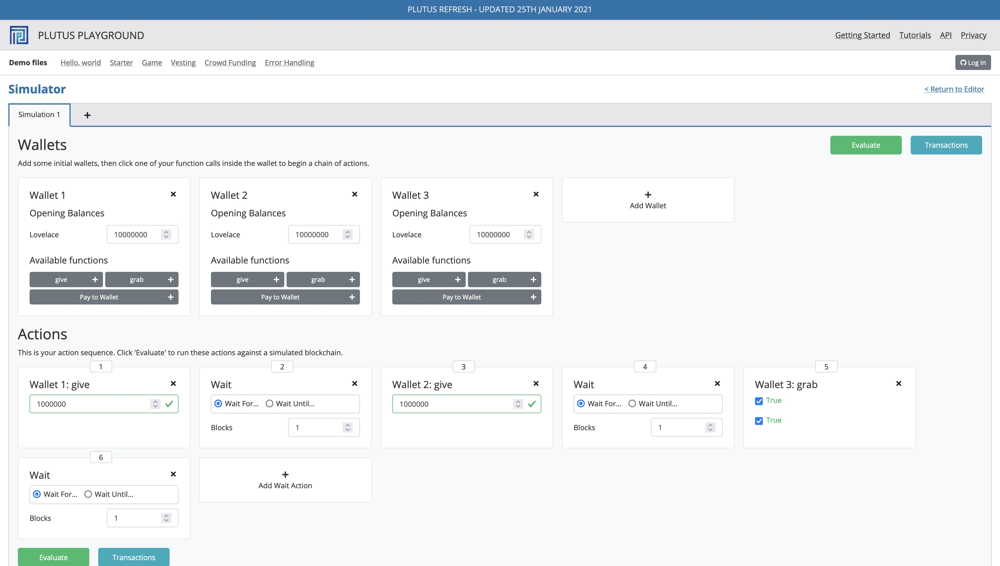

Implementation One -- Shabby:

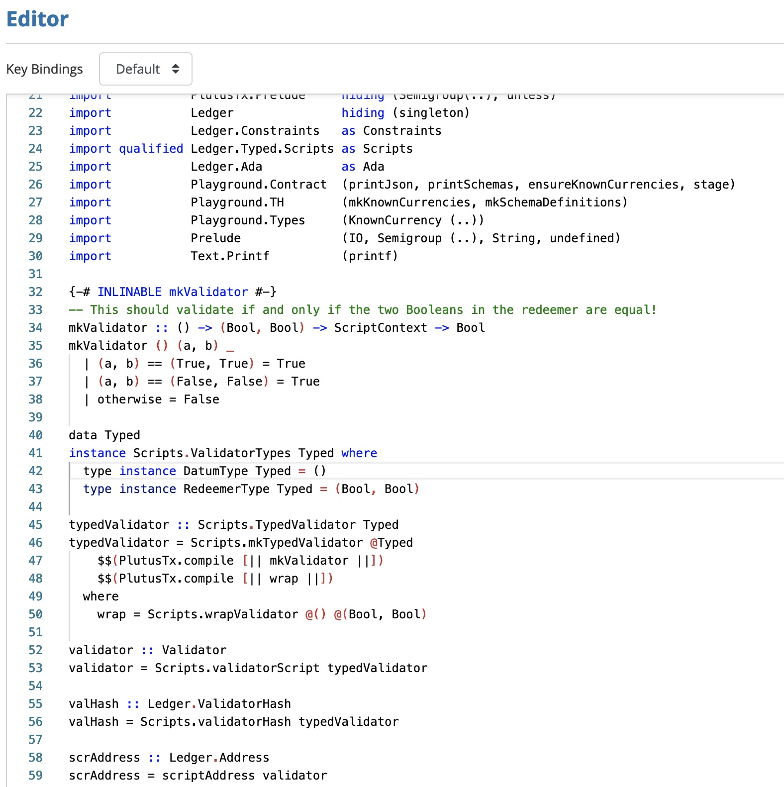

Transactional Data 1:

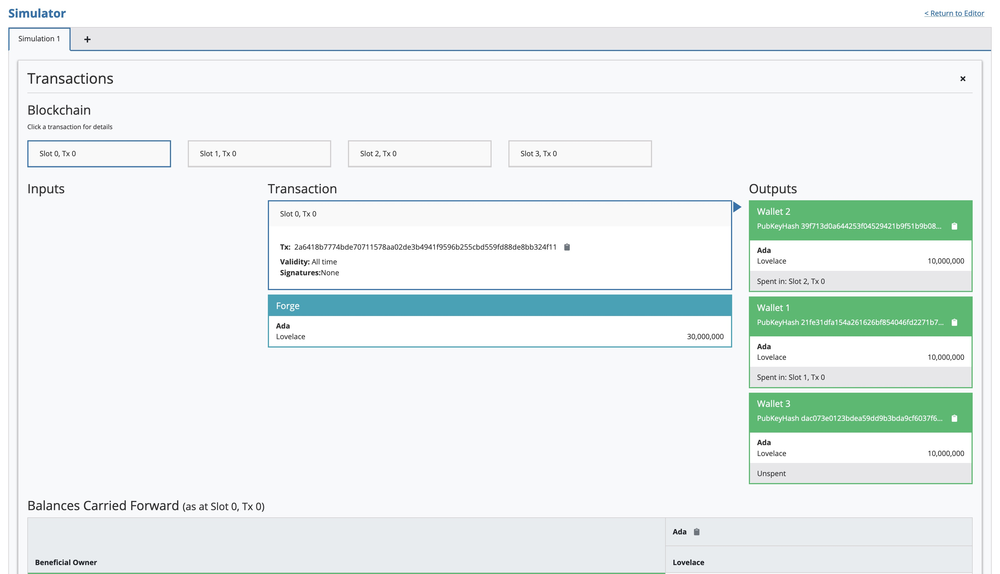

Transaction Data 2:

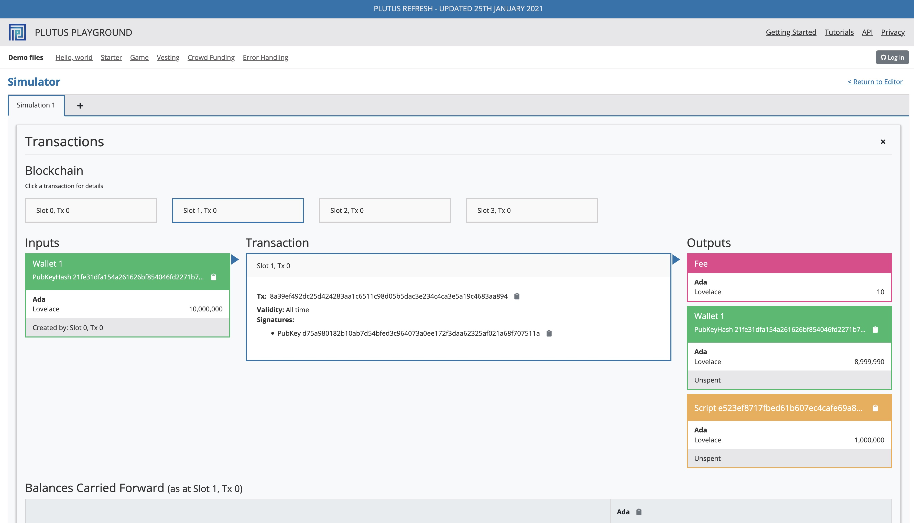

Transaction Data 3:

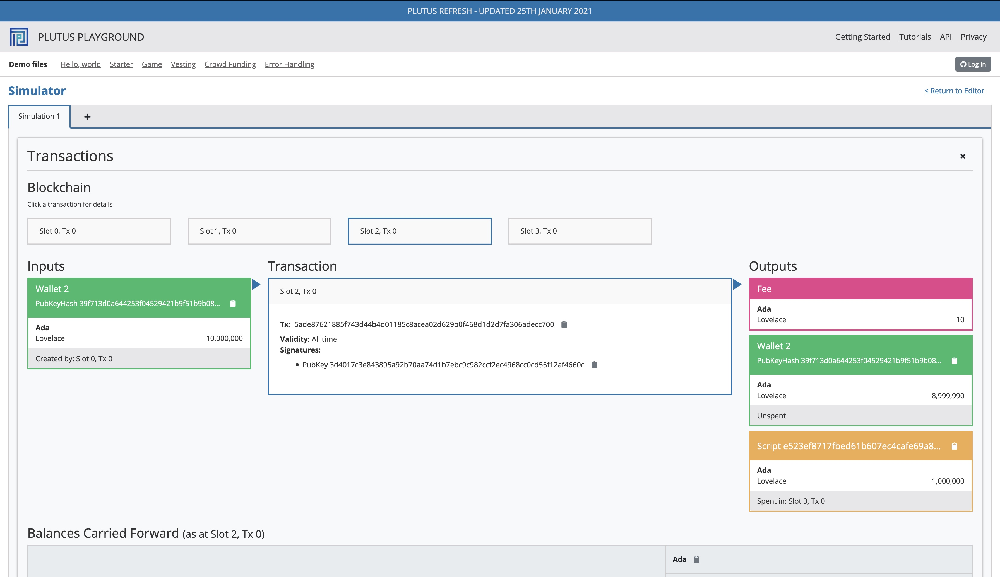

Transaction Data 4:

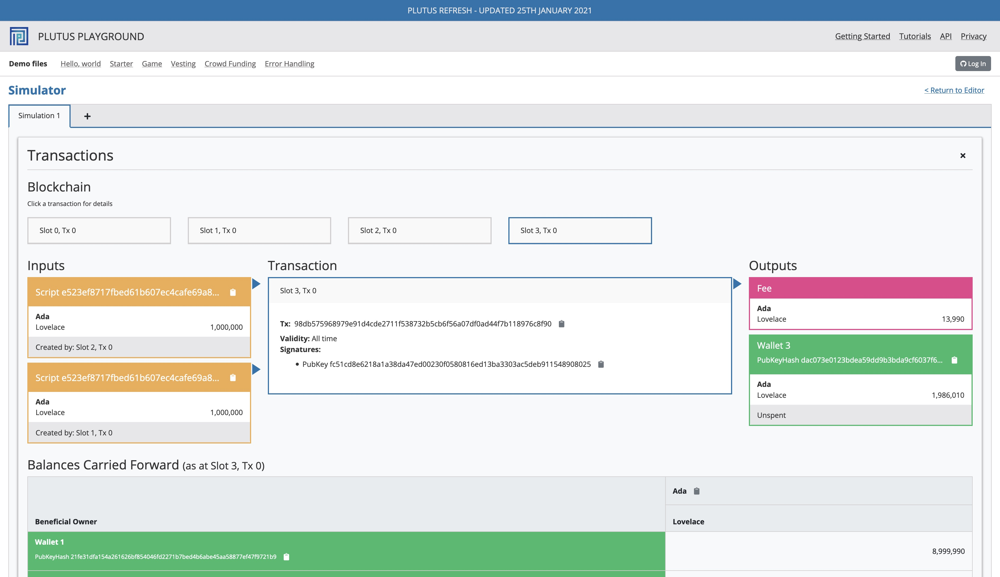

Transaction Data 5:

Transaction Data 6:

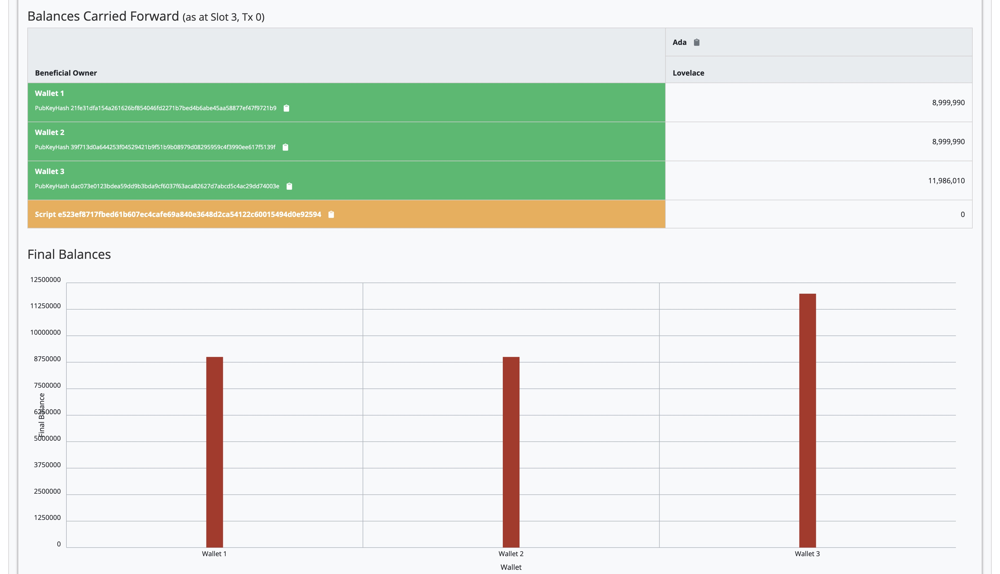

Log Data:

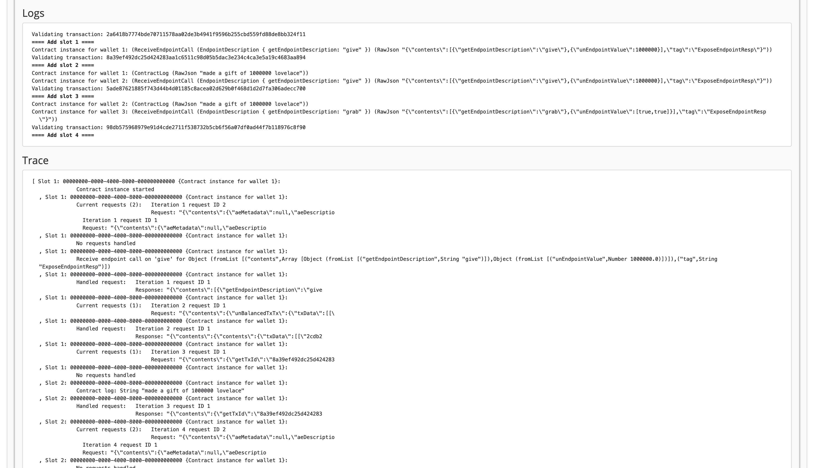

# 6. Homework 2: Completed - Essentially Same As HW1

See My comments for additional details...

	{-# LANGUAGE DataKinds           #-}
	{-# LANGUAGE DeriveAnyClass      #-}
	{-# LANGUAGE DeriveGeneric       #-}
	{-# LANGUAGE FlexibleContexts    #-}
	{-# LANGUAGE NoImplicitPrelude   #-}
	{-# LANGUAGE OverloadedStrings   #-}
	{-# LANGUAGE ScopedTypeVariables #-}
	{-# LANGUAGE TemplateHaskell     #-}
	{-# LANGUAGE TypeApplications    #-}
	{-# LANGUAGE TypeFamilies        #-}
	{-# LANGUAGE TypeOperators       #-}
	
	{-# OPTIONS_GHC -fno-warn-unused-imports #-}
	
	module Week02.Homework2 where
	
	import           Control.Monad        hiding (fmap)
	import           Data.Aeson           (FromJSON, ToJSON)
	import           Data.Map             as Map
	import           Data.Text            (Text)
	import           Data.Void            (Void)
	import           GHC.Generics         (Generic)
	import           Plutus.Contract
	import qualified PlutusTx
	import           PlutusTx.Prelude     hiding (Semigroup(..), unless)
	import           Ledger               hiding (singleton)
	import           Ledger.Constraints   as Constraints
	import qualified Ledger.Typed.Scripts as Scripts
	import           Ledger.Ada           as Ada
	import           Playground.Contract  (printJson, printSchemas, ensureKnownCurrencies, stage, ToSchema)
	import           Playground.TH        (mkKnownCurrencies, mkSchemaDefinitions)
	import           Playground.Types     (KnownCurrency (..))
	import           Prelude              (IO, Semigroup (..), String, undefined)
	import           Text.Printf          (printf)
	
	data MyRedeemer = MyRedeemer
	    { flag1 :: Bool
	    , flag2 :: Bool
	    } deriving (Generic, FromJSON, ToJSON, ToSchema)
	
	PlutusTx.unstableMakeIsData ''MyRedeemer
	
	{-# INLINABLE mkValidator #-}
	
	-- This should validate if and only if the two Booleans in the redeemer are equal!
	
	mkValidator :: () -> MyRedeemer -> ScriptContext -> Bool
	
	-- J.D: Implementing parameters for mkValidator
	-- Datum: of type unit ... this can be empty
	-- Redeemer: of type data ... contains this is our own record type containing two bools
	-- Context: of type ScriptContext ... we can leave this as undefined for the purposes of this smart contract ...
	
	mkValidator () (MyRedeemer x y) _ = traceIfFalse "Wrong Redeemer" $ x == y
	
	-- J.D: Similarly to the previous homework, the Datum parameter instance is of type DatumType, and is an empty unit
	-- This time, MyRedeemer is an instance of type: RedeemerType
	
	data Typed
	instance Scripts.ValidatorTypes Typed where
	    type instance DatumType Typed = ()
	    type instance RedeemerType Typed = MyRedeemer
	
	-- We're essentially just doing the same as before...
	-- except instead of (bool, bool) tuple, we're using @MyRedeemer to compile the Validator
	
	typedValidator :: Scripts.TypedValidator Typed
	typedValidator = Scripts.mkTypedValidator @Typed
	    $$(PlutusTx.compile [|| mkValidator ||])
	    $$(PlutusTx.compile [|| wrap ||])
	  where
	    wrap = Scripts.wrapValidator @() @MyRedeemer
	
	-- exactly the same as Homework01
	
	validator :: Validator
	validator = Scripts.validatorScript typedValidator
	
	valHash :: Ledger.ValidatorHash
	valHash = Scripts.validatorHash typedValidator
	
	scrAddress :: Ledger.Address
	scrAddress = scriptAddress validator
	
	-- Lars was kind enough to implement the remainder! Thank you! I hope this compiles...
	
	type GiftSchema =
	            Endpoint "give" Integer
	        .\/ Endpoint "grab" MyRedeemer
	
	give :: AsContractError e => Integer -> Contract w s e ()
	give amount = do
	    let tx = mustPayToTheScript () $ Ada.lovelaceValueOf amount
	    ledgerTx <- submitTxConstraints typedValidator tx
	    void $ awaitTxConfirmed $ txId ledgerTx
	    logInfo @String $ printf "made a gift of %d lovelace" amount
	
	grab :: forall w s e. AsContractError e => MyRedeemer -> Contract w s e ()
	grab r = do
	    utxos <- utxoAt scrAddress
	    let orefs   = fst <$> Map.toList utxos
	        lookups = Constraints.unspentOutputs utxos      <>
	                  Constraints.otherScript validator
	        tx :: TxConstraints Void Void
	        tx      = mconcat [mustSpendScriptOutput oref $ Redeemer $ PlutusTx.toData r | oref <- orefs]
	    ledgerTx <- submitTxConstraintsWith @Void lookups tx
	    void $ awaitTxConfirmed $ txId ledgerTx
	    logInfo @String $ "collected gifts"
	
	endpoints :: Contract () GiftSchema Text ()
	endpoints = (give' `select` grab') >> endpoints
	  where
	    give' = endpoint @"give" >>= give
	    grab' = endpoint @"grab" >>= grab
	
	mkSchemaDefinitions ''GiftSchema
	
	mkKnownCurrencies []
	
### 6.1 Images:

**Simulation:**

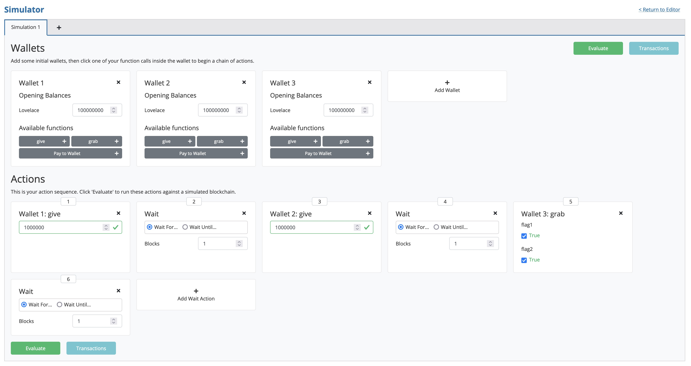

**Tx0:**

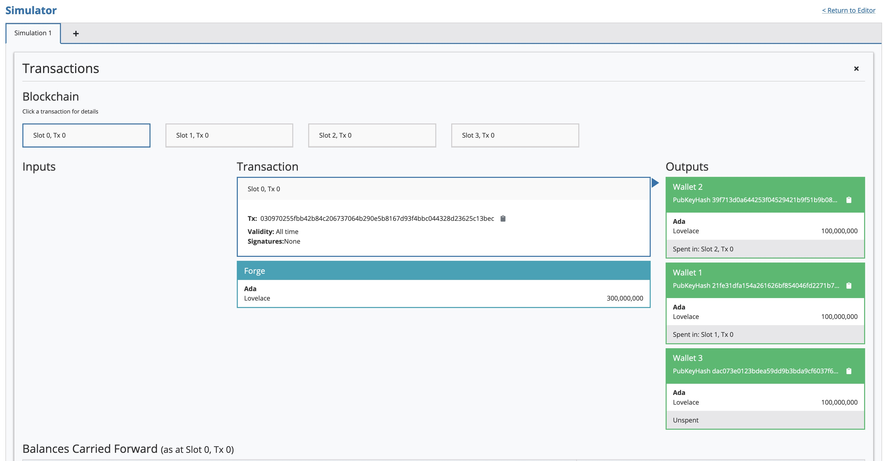

**Tx4:**

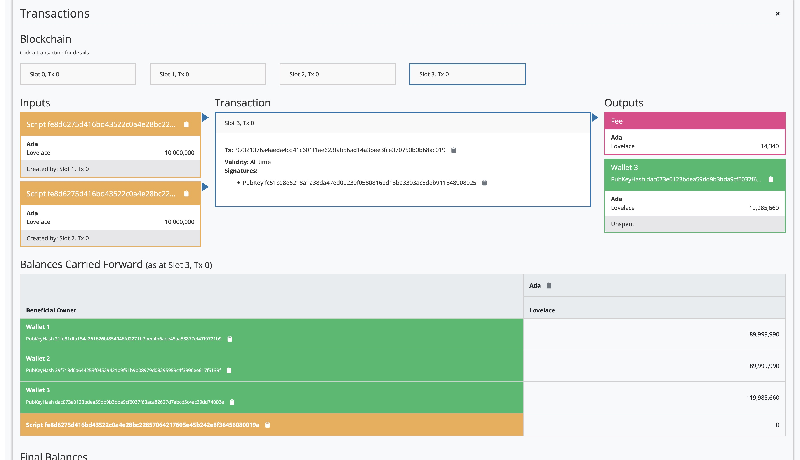

**Balances, Logs:**

**Trace:**

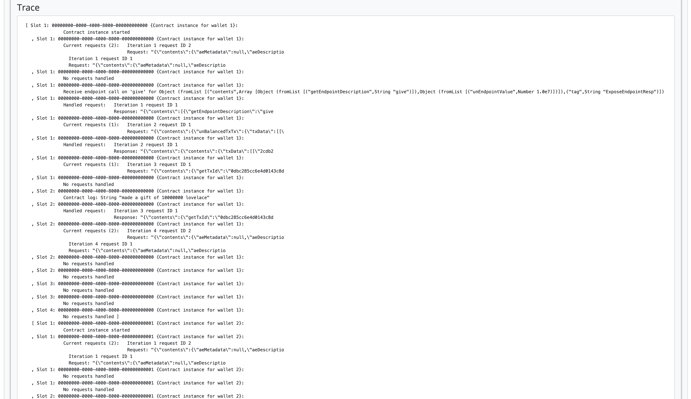

### 7. Catch Up On TODOs

##### TODO: 1. Implement a redeemer that always evaluates to False...

*I may just leave this, as I've already done the homework, seems fairly trivial...*

**I did come back to this and give it some more thought**, as initially it seemed fairly trivial (which it is, but still, given a couple of days of being away from the course, it's good to do a quick catch up.). The validator which is compiled by PlutuxTx is essentially laying out the conditions under which the UTxO may be spent. The Redeemer can be of many different types, but it is typical to use a 'record' type (self-defined) so long as it implements: isData. To have your redeemer always evaluate to false would simply require (and this is untested, but I assumed it works) some code, such as the following:

	mkValidator () (a) _
	| (a) == (True) = False
	| (a) == (False) = False
	| otherwise = False
	
*I'm not super familiar with Haskell, but I assume the following will also work:*

	mkValidator () () _ = traceIfFalse "Wrong Redeemer" $ False == True
	-- | I imagine, even though there are no parameters within the redeemer
	-- | This would always evaluate to False.

### 8. Summary:

During this lecture and the homework excises we learnt about the differences between a UTxO model and an EUTxO Model, but these were interceded during last lecture too. We leant about redeemers, datum and context (and by proxy: validators). However, we went into much more detail during this lecture. For example we implemented our own validators with our own redeemer types. These were very basic redeemers, and essentially just checked a simple expression: that X == Y using basic data types initially, but then we also did create our own record types that implemented isData. Furthermore, we also learnt about the compiler that processes Haskell and turns it into Plutus-core (Plutus-tx) and that essentially everything ends up being Lambda Calculus (System F Omega with Recursive Data Types). Finally, we completed two home-works.