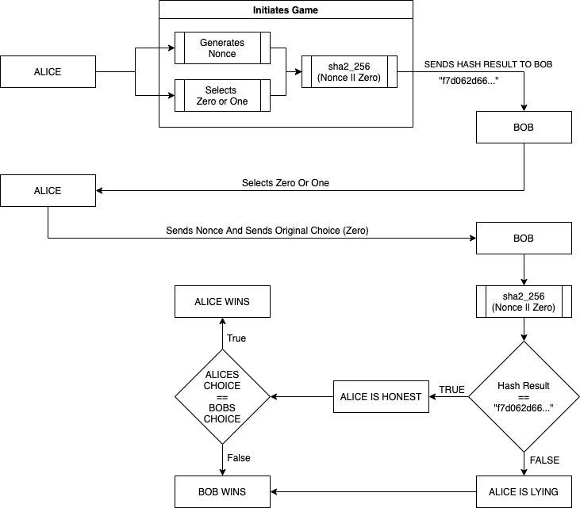

# Lecture Seven

> "Constraints Liberate, Liberties Constrain"  
> — Runar Bjarnason

### 1. Introduction

*Note: You always write your introduction last.*

### 2. Committal Schemes

We see these types of techniques used within network protocols quite a bit. I believe (if I remember correctly from my Cryptography module, six years ago) the Diffe Hellman protocol uses a committal scheme, or some kind of assumption. Anyway, what we're essentially doing is communicating with a potential untrustworthy party in a manner where they cannot read what we send them until the appropriate point within the protocol.

For example, consider the following game where the rules are: if you select the same value as your opponent, you win, else, you loose. However, this game must be played synchronously, which means you have to pick a value first, *but if your opponent could see what you selected*, **that would be a problem**. Plus, you both cannot trust one another. So, how do we get around this little dilemma?

There are a lot of variants of committal schemes, but the simplest to explain is as follows:

*Note: You are called Alice, and your opponent is called Bob.*

1. You attempt to initiate a game (by betting 500 ADA).
2. An opponent matches your bet of 500 ADA before a pre-defined clock runs out.
3. You are both now playing one another, since you initiated the game, you go first.
4. You generate a pseudo-random number, let's call this Q.
5. You select a value from the set of {0, 1}, let's call this Y.
6. You use a hashing algorithm (say: sha2_256) to encode Q concatenated with Y:
7. <code>Initial Selection <- sha2_256(Q ++ Y)</code>
8. <code>Initial Selection = "3Ef7d062d66..."</code>
9. You send Bob the value of the initial selection.
10. Bob now sends his selected value to you.
11. Now, you send Q and Y to Bob.
12. IFF Bob runs the <code>sha2_256(Q ++ Y)</code> and sees the result you previously sent him, he knows you are acting honestly (provably fair).
13. Bob then knows if he has won or lost.
14. You also know if you have won or lost.

*Note: a point failed to be addressed within the lecture is: what if Bob decided to pretend Alice is lying, even when she is not?" I understand that is regardless in relation to running a smart contract, because it will do as you tell it to. But, if this was a simple network protocol, couldn't Bob use something like Wireshark to modify the contents of the payload in the package he may send back to Alice to say that he had lost?*

Please see the below image for additional details.

 

### 3. Applications: State Machines

What is an application? Usually it is something that runs and applies itself to change the state of something in a useful manner. Haskell wasn't much good for that, up until recently. Plutus-core which is implemented by compiling it from Haskell is what is used to trigger the validate transactions (of many kinds) on the Cardano blockchain.